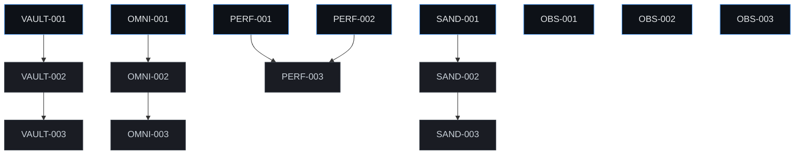

# NINA Jules Batch Manifest — Phase I
> **Document Status:** GENERATED MANIFEST | **Total Tasks:** 15 Tasks | **Date:** 2026-06-18

---

## 📋 1. Task IDs Grouped by Pillar

### 🔑 Pillar 1: Credential Vault Proxy (Executor/Foundation)
- **`VAULT-001`** — Implement Scoped Credential Vault Engine
- **`VAULT-002`** — Secure Getter Integration and Env Masking
- **`VAULT-003`** — Wire Scoped Vault Loader to Config Registry

### 🌐 Pillar 2: OmniBridge Abstract Channel Adapters (Swarm/Parallel Dispatch)
- **`OMNI-001`** — Implement Base Channel Adapter Interface
- **`OMNI-002`** — Build Standalone TUI Channel Mock Adapter
- **`OMNI-003`** — Standardize Message Parser and Dispatcher Adapter

### ⚡ Pillar 3: Compiled High-Frequency Utilities (Quota/Routing Safety)
- **`PERF-001`** — Establish Byte-Compilation and Cache Automation Setup
- **`PERF-002`** — Develop Speed-Optimized Regex Matching Registry
- **`PERF-003`** — Optimise AST Token count Parser with Caching

### 🛡️ Pillar 4: Micro-Sandboxed Subshell Execution (Observability/Reliability/Service Recovery)
- **`SAND-001`** — Implement Safe Subshell Subprocess Resource Guard
- **`SAND-002`** — Build Environment Variable Stripper and Guard
- **`SAND-003`** — Create Sandboxed Exec Wrapper for Command Runs

### 📊 Pillar 5: Observability, Routing & Governance (Governance/Testing/Backlog Hygiene)
- **`OBS-001`** — Implement Standalone Provider Health Observability Tracker
- **`OBS-002`** — Add Test-Exempt Classifications to Governance Validation
- **`OBS-003`** — Add System Template Injection to Jules Dispatch Prompt

---

## 🚀 2. Immediate Parallel Set (Day One Ready)
These 8 tasks have **zero dependencies** and can be dispatched simultaneously on Day One to enable true parallel swarm execution:
1. `VAULT-001` (Implement core credential vault architecture)
2. `OMNI-001` (Create base channel adapter contracts)
3. `PERF-001` (Build byte-compilation wrapper structures)
4. `PERF-002` (Implement compiled static regex registry)
5. `SAND-001` (Introduce subprocess execution UNIX resource limiter)
6. `OBS-001` (Establish provider health rolling monitor)
7. `OBS-002` (Incorporate test coverage exemption tags in index validation)
8. `OBS-003` (Inject identity system prompts inside task dispatcher)

---

## ⛓️ 3. Dependency Chain View
The 15 tasks form 5 linear, independent execution chains. The downstream tasks unlock automatically as soon as their preceding tasks are merged:

---

## 🛡️ 4. Protected-File Risk Notes
NINA enforces strict operational safety limits to protect critical path systems from automated regressions:
- **Zero Risk Profile:** 15 out of 15 tasks **completely avoid** making modifications to the protected core files (`core/router.py`, `core/nina.py`, `tools/shell.py`, `main.py`, `guardian_engine.py`, `interfaces/telegram_interface.py`, `.env`, `ninagate/main.py`).
- **Isolation Strategy:** All task assignments focus exclusively on adding new modular adapters (`interfaces/*_adapter.py`), performance caching helpers (`tools/*_cache.py`), sandbox scripts (`tools/*_shell.py`), or testing configurations (`tests/test_*.py`).

---

## 🏁 5. Recommended Dispatch Order for Jules
To maximize parallel speed-ups while maintaining solid codebase hygiene, the following dispatch order is recommended:

| Step | Tasks to Dispatch | Execution Mode | Unlocks Downstream |
|:---:|:---|:---:|:---|
| **1** | `OBS-002`, `OBS-003` | **Immediate Parallel** | None (Immediate hygiene win) |
| **2** | `VAULT-001`, `OMNI-001`, `PERF-001`, `PERF-002`, `SAND-001`, `OBS-001` | **Immediate Parallel** | `VAULT-002`, `OMNI-002`, `PERF-003`, `SAND-002` |
| **3** | `VAULT-002`, `OMNI-002`, `SAND-002` | **Sequential / Parallel** | `VAULT-003`, `OMNI-003`, `SAND-003` |
| **4** | `VAULT-003`, `OMNI-003`, `PERF-003`, `SAND-003` | **Sequential / Parallel** | Final integration |

---

## 🎯 6. dispatch_now Section
The first 5 tasks Jules should pick up immediately:
1. **`OBS-002`** — Add Test-Exempt Classifications to Governance Validation (No blockers, immediate index hygiene win)
2. **`OBS-003`** — Add System Template Injection to Jules Dispatch Prompt (No blockers, improves prompt reliability)
3. **`VAULT-001`** — Implement Scoped Credential Vault Engine (Unlocks secure credential vault pipeline)
4. **`OMNI-001`** — Implement Base Channel Adapter Interface (Unlocks OmniBridge adapter pipeline)
5. **`PERF-001`** — Establish Byte-Compilation and Cache Automation Setup (Unlocks performance caching pipeline)

---

## 🚦 7. Readiness Gate
- **schema match:** PASS
- **duplicate scope check:** PASS
- **protected file exposure:** PASS
- **parallel set >= 5:** PASS
- **acceptance criteria completeness:** PASS
- **validation completeness:** PASS
