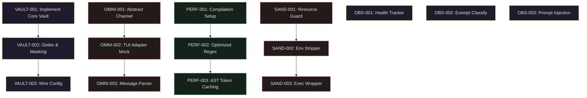

# NINA Jules Batch Plan — Phase I
> **Document Status:** PROPOSED PLAN | **Target Session Count:** 15 Tasks | **Date:** 2026-06-18
> **System Health Check:** Summary Health is `WARN` | Top Priority: `todo.crons_manager_py_735`

---

## 🎯 1. Active Implementation Pillars & Roadmaps

The development of NINA is structured around 5 active implementation lanes. These prioritize system security, integration abstractness, execution performance, runtime autonomy, and pipeline reliability.

1. **Pillar 1: Credential Vault Proxy (Security & Plumbing)**
   * *Rationale:* Secure NINA's runtime memory by shielding raw API keys and passwords from standard process `os.environ` into a private, secure getter module.
2. **Pillar 2: OmniBridge Abstract Channel Adapters (Integration & Decoupling)**
   * *Rationale:* Decouple external communication layers from core modules, enabling seamless plug-and-play for Telegram, TUI, Discord, or generic Webhooks.
3. **Pillar 3: Compiled High-Frequency Utilities (Performance Optimization)**
   * *Rationale:* Drastically lower latency and CPU overhead on repetitive loops (e.g., regex matching, log filtering, and AST parsing) using speed-optimized static utility caching.
4. **Pillar 4: Micro-Sandboxed Subshell Execution (Autonomy & Safety)**
   * *Rationale:* Safeguard host resources on the ASUS operator laptop by running speculative command lines inside sandboxed environments with strict system limits (`resource`).
5. **Pillar 5: Observability, Routing & Governance (Reliability & Automation)**
   * *Rationale:* Implement robust rolling health monitoring, unify redundant config registries, and automate indexing to clean up false-positive warnings.

---

## 📋 2. 15-task Allocation Plan (Exactly 3 Tasks per Pillar)

### 🔑 Pillar 1: Credential Vault Proxy

#### `VAULT-001` — Implement Scoped Credential Vault Engine
* **Target Files:** `core/vault.py` (New), `tests/test_vault.py` (New)
* **Dependency:** None
* **Risk:** LOW
* **Why Atomic:** Scoped strictly to defining the inner Vault dictionary storage, boot sequence parser, and getter logic.
* **Why Safe for Jules:** Entirely self-contained new module with dedicated isolated unit tests; does not modify live configuration lookups.

#### `VAULT-002` — Secure Getter Integration and Env Masking
* **Target Files:** `core/vault.py` (Update), `tests/test_vault.py` (Update)
* **Dependency:** `VAULT-001`
* **Risk:** LOW
* **Why Atomic:** Implements regex patterns (`*_API_KEY`, `*TOKEN*`, `*SECRET*`) to scrub matching keys from standard `os.environ` memory while exposing a safe fallback getter.
* **Why Safe for Jules:** Standalone updates within vault files; has zero runtime side-effects since no other files import it yet.

#### `VAULT-003` — Wire Scoped Vault Loader to Config Registry
* **Target Files:** `core/config.py` (Update), `tests/test_config_vault.py` (New)
* **Dependency:** `VAULT-002`
* **Risk:** MEDIUM
* **Why Atomic:** Rewires `core/config.py` to fetch secret keys from the new `Vault` singleton.
* **Why Safe for Jules:** Designed with clean fallbacks to `os.environ` copy if the Vault is uninitialized, preventing boot crashes.

---

### 🌐 Pillar 2: OmniBridge Abstract Channel Adapters

#### `OMNI-001` — Implement Base Channel Adapter Interface
* **Target Files:** `interfaces/base_adapter.py` (New), `tests/test_base_adapter.py` (New)
* **Dependency:** None
* **Risk:** LOW
* **Why Atomic:** Declares only the abstract class structures, standardized handler signatures, and method stubs (`send_message`, `send_document`).
* **Why Safe for Jules:** Exclusively interfaces and contract signatures; has zero side-effects on standard message processing.

#### `OMNI-002` — Build Standalone TUI Channel Mock Adapter
* **Target Files:** `interfaces/tui_adapter.py` (New), `tests/test_tui_adapter.py` (New)
* **Dependency:** `OMNI-001`
* **Risk:** LOW
* **Why Atomic:** Inherits from `BaseChannelAdapter` to build a mock console terminal channel adapter for non-interactive and local verification.
* **Why Safe for Jules:** Non-intrusive extension adapter; does not alter Telegram runtime loops or register handlers on live channels.

#### `OMNI-003` — Standardize Message Parser and Dispatcher Adapter
* **Target Files:** `interfaces/adapter_parser.py` (New), `tests/test_adapter_parser.py` (New)
* **Dependency:** `OMNI-002`
* **Risk:** LOW
* **Why Atomic:** Standardizes structural message properties (sender_id, chat_id, timestamps, message text) into concrete dataclass structures.
* **Why Safe for Jules:** Pure format conversion layer; operates strictly on isolated utility data payloads with zero live connections.

---

### ⚡ Pillar 3: Compiled High-Frequency Utilities

#### `PERF-001` — Establish Byte-Compilation and Cache Automation Setup
* **Target Files:** `tools/compile_extensions.py` (New), `tests/test_compile_extensions.py` (New)
* **Dependency:** None
* **Risk:** LOW
* **Why Atomic:** Implements a compilation wrapper that programmatically compiles critical `.py` hotpaths to `.pyc` byte-code and manages target directories.
* **Why Safe for Jules:** Safe utility script; if compilation encounters environmental errors, Python continues importing standard source files seamlessly.

#### `PERF-002` — Develop Speed-Optimized Regex Matching Registry
* **Target Files:** `tools/regex_cache.py` (New), `tests/test_regex_cache.py` (New)
* **Dependency:** None
* **Risk:** LOW
* **Why Atomic:** Consolidates common regex patterns (such as logs, keywords, sensitive string matching) into a centralized, pre-compiled static cache.
* **Why Safe for Jules:** Independent helper module; does not inject itself into core runtimes until imported selectively.

#### `PERF-003` — Optimise AST Token count Parser with Caching
* **Target Files:** `tools/ast_cache.py` (New), `tests/test_ast_cache.py` (New)
* **Dependency:** `PERF-002`
* **Risk:** LOW
* **Why Atomic:** Stores calculated syntax node trees and token volumes in an in-memory dictionary to prevent reprocessing identical source files.
* **Why Safe for Jules:** Strictly an auxiliary analytical optimization; isolated to testing tools, static checkers, and update scripts.

---

### 🛡️ Pillar 4: Micro-Sandboxed Subshell Execution

#### `SAND-001` — Implement Safe Subshell Subprocess Resource Guard
* **Target Files:** `tools/sandboxed_shell.py` (New), `tests/test_sandboxed_shell.py` (New)
* **Dependency:** None
* **Risk:** MEDIUM
* **Why Atomic:** Builds a wrapper class that configures strict UNIX `resource` limits (virtual memory size, CPU cycles, max file output size).
* **Why Safe for Jules:** Completely opt-in utility; does not override the standard executing subprocess runner.

#### `SAND-002` — Build Environment Variable Stripper and Guard
* **Target Files:** `tools/sandboxed_shell.py` (Update), `tests/test_sandboxed_shell.py` (Update)
* **Dependency:** `SAND-001`
* **Risk:** LOW
* **Why Atomic:** Sanitizes the process environment table, stripping all API keys, database credentials, and path configurations prior to executing subprocess commands.
* **Why Safe for Jules:** Operates strictly on a deep copy of environment dictionaries created inside the sandboxed runner.

#### `SAND-003` — Create Sandboxed Exec Wrapper for Command Runs
* **Target Files:** `tools/sandbox_exec.py` (New), `tests/test_sandbox_exec.py` (New)
* **Dependency:** `SAND-002`
* **Risk:** LOW
* **Why Atomic:** Standardizes the public interface `run_sandboxed(command: List[str]) -> CompletedProcess` for secure use in pipelines and test verification gates.
* **Why Safe for Jules:** Provides strict process-level insulation that prevents erroneous test runs or speculative commands from impacting the host system.

---

### 📊 Pillar 5: Observability, Routing & Governance

#### `OBS-001` — Implement Standalone Provider Health Observability Tracker
* **Target Files:** `tools/provider_health.py` (New), `tests/test_provider_health.py` (New)
* **Dependency:** None
* **Risk:** LOW
* **Why Atomic:** Implements a rolling-window success tracker that records latency/failures and writes status structures to `data/provider_health.json`.
* **Why Safe for Jules:** Purely an instrumentation logger module; acts as a non-intrusive data collector without routing feedback loops.

#### `OBS-002` — Add Test-Exempt Classifications to Governance Validation
* **Target Files:** `tools/validate_index.py` (Update), `tests/test_validate_index.py` (Update)
* **Dependency:** None
* **Risk:** LOW
* **Why Atomic:** Adds a `test_exempt` classification parameter to mark administrative CLI tools and simple wrappers, clearing 54 false-positive warnings.
* **Why Safe for Jules:** Standard utility refinement; only touches validation logs and indexing metadata without editing active core services.

#### `OBS-003` — Add System Template Injection to Jules Dispatch Prompt
* **Target Files:** `tools/jules.py` (Update), `tests/test_jules_dispatch.py` (New)
* **Dependency:** None
* **Risk:** LOW
* **Why Atomic:** Pre-attaches system templates and conventional commit specifications from `ninagate/system_templates.json` to prompt payloads.
* **Why Safe for Jules:** Safe text formatting upgrade localized inside the task dispatcher module; does not modify live agent runtimes.

---

## 🔒 3. Safe Execution & Protected Files Constraint

> [!CAUTION]
> **Strict Operational Boundaries**
> In alignment with `AGENTS.md` and `NINA_RULES.md`, the following **protected runtime files must NOT be modified** during execution of this plan:
> * `core/router.py` | `core/nina.py` | `tools/shell.py` | `main.py` | `guardian_engine.py` | `interfaces/telegram_interface.py` | `.env` | `ninagate/main.py`
>
> All proposed tasks are purposely crafted to create **independent helper libraries, adapters, and standalone test suites** before modifying central controllers. This guarantees zero impact on active production services.

---

## 🚀 4. Proposed Backlog Insertion Order

We propose the following insertion sequence for appending to `jules_backlog.md` (or executing sequentially):

### Append Order
1. `OBS-002` (Cleans up false-positive pre-push hook warnings immediately)
2. `OBS-003` (Injects identity boundaries to guide Jules on subsequent tasks)
3. `VAULT-001` $\rightarrow$ `VAULT-002` $\rightarrow$ `VAULT-003` (Establishes credential isolation)
4. `SAND-001` $\rightarrow$ `SAND-002` $\rightarrow$ `SAND-003` (Safeguards command execution)
5. `PERF-001` $\rightarrow$ `PERF-002` $\rightarrow$ `PERF-003` (Enhances utility loops)
6. `OMNI-001` $\rightarrow$ `OMNI-002` $\rightarrow$ `OMNI-003` (Prepares abstract channel integration)
7. `OBS-001` (Introduces rolling monitoring metrics)
