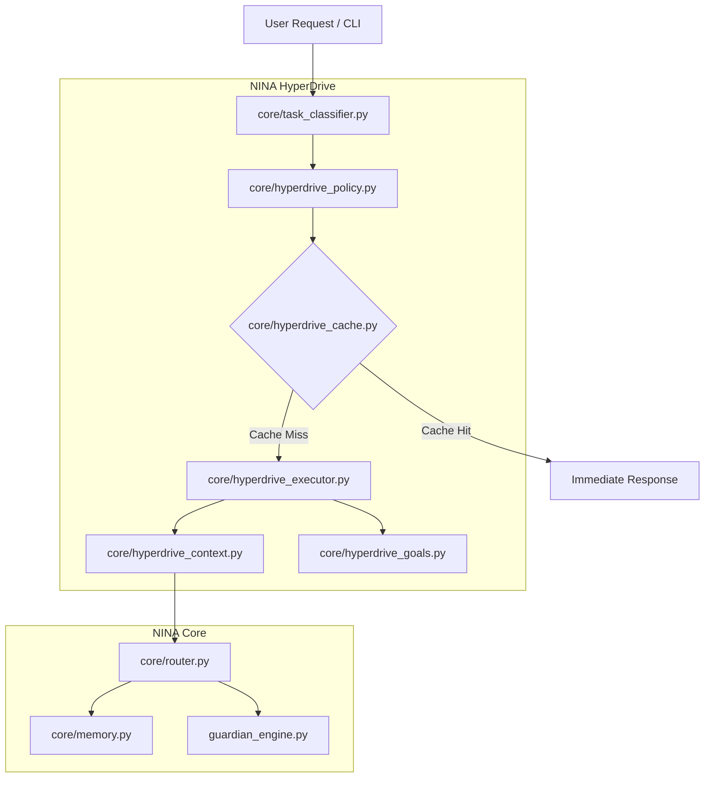

# SURGICAL IMPLEMENTATION PLAN: NINA HyperDrive

This implementation plan defines the exact modules, file touchpoints, phased rollout sequence, and architectural blueprint for integrating the **NINA HyperDrive** acceleration layer. It strictly adheres to the philosophy of **preservation-first acceleration**—leaving NINA's core systems intact while adding caching, parallel execution, speculative actions, goal state persistence, and optimal model policies.

---

## 🛠️ Architecture: The 5-Module Blueprint

Rather than altering or bloating NINA's core files, the HyperDrive layer will live as five independent, modular Python scripts under the `core/` directory:



### 1. `core/hyperdrive_context.py` (Context Optimization Engine)
* **Objective**: Replace chat history replay with ranked semantic context, observation masking, and token compression.
* **Core Functions**:
  * `compress_state(history: List[dict]) -> str`: Condenses old threads into a single state summary once the total character count exceeds `12000`.
  * `rank_relevance(chunks: List[dict], query: str) -> List[dict]`: Reranks Chroma vector search outputs using semantic-recency scaling.
  * `mask_observations(content: str) -> str`: Selectively filters large stdout dumps, keeping only status lines and structural headers.

### 2. `core/hyperdrive_policy.py` (Model Policy Layer)
* **Objective**: Decide the cheapest, fastest adequate execution path before invoking the router.
* **Core Functions**:
  * `estimate_required_tier(task) -> str`: Maps classified tasks to `LOCAL`, `FAST`, `DEEP`, or `PREMIUM`.
  * `is_cacheable(prompt: str) -> bool`: Analyzes whether the task has high determinism (e.g., git analysis, file read summaries).
  * `enforce_token_budget(session_id: str) -> bool`: Monitors cumulative token usage, forcing local fallbacks if soft limit quotas are crossed.

### 3. `core/hyperdrive_cache.py` (Semantic & Workflow Cache)
* **Objective**: Store successful execution graphs, tool outputs, and plans.
* **Core Functions**:
  * `get_semantic_match(prompt: str) -> dict`: Looks up similar recent prompts using Cosine similarity.
  * `cache_workflow(task_signature: str, plan_graph: dict) -> None`: Stores compiled plans for repetitive workflows.
  * `cache_tool_output(tool_name: str, args: dict, output: str) -> None`: Caches deterministic tool returns (e.g., system package checks, static imports).

### 4. `core/hyperdrive_executor.py` (Execution Graph Engine & Speculator)
* **Objective**: Construct task DAGs and speculate read-only tool steps.
* **Core Functions**:
  * `build_dag(goal: str) -> TaskDAG`: Decomposes high-level instructions into executable dependencies.
  * `speculate_next_step(current_node: TaskNode) -> str`: Uses local fast models (e.g., Qwen 1.5B) to predict the likely next tool step.
  * `execute_parallel(nodes: List[TaskNode]) -> dict`: Concurrently fires independent research or code analysis nodes.

### 5. `core/hyperdrive_goals.py` (Persistent Goal & Task Queue)
* **Objective**: Maintain a lightweight state manager for resumable, background execution.
* **Core Functions**:
  * `upsert_goal(goal_id: str, status: str, steps: list) -> None`: Stores active goals and sub-steps in the relational SQLite schema.
  * `serialize_state_capsule(session_id: str) -> str`: Packages intermediate variables and active assumptions into a tiny inject-ready string.

---

## 📍 File Touch List (Minimal Disruption)

| Target File | Impact | HyperDrive Hooks to Add |
| :--- | :--- | :--- |
| `core/nina.py` | **Low** | Initialize `HyperDriveGoalManager` on startup. Insert pre-route and post-route hooks inside the core request handler to check cache and persistence. |
| `core/router.py` | **None** | No changes. HyperDrive's `hyperdrive_policy.py` will call `HybridRouter.route()` after defining the optimal target strategy. |
| `core/memory.py` | **Low** | Add a helper method to interface with `hyperdrive_context.py` for advanced reranking and state summaries. |
| `idleloop.py` | **Medium** | Adapt the background idle runner to trigger `hyperdrive_goals.py` for deferred precomputation and workflow template mining when inactive. |
| `guardian_engine.py` | **Low** | Integrate HyperDrive metrics (cache efficiency, latency saved, speculative accuracy) into the health reporting system. |
| `data/` | **Low** | Maintain three light files: `data/goals.json`, `data/workflow_cache.json`, and `data/tool_cache.json`. |

---

## 📈 Phased Rollout Sequence

```
Phase 1: Quick Wins   Phase 2: Core Memory     Phase 3: Parallelism     Phase 4: Autonomy
  - Semantic Cache       - State Capsules        - Task DAG Engine        - Idle precomputes
  - Policy Layer         - Reranking             - Concurrent Workers     - Speculative runs
```

### Phase 1: Quick Wins (Immediate Efficiency)
* **Goals**: Deploy `core/hyperdrive_cache.py` and `core/hyperdrive_policy.py`.
* **Action**: Route repetitively called CLI tasks (e.g., code diagnostics, folder lists) through the semantic cache. Integrate token budgets into the policy manager.

### Phase 2: Core Memory Layer Integration
* **Goals**: Deploy `core/hyperdrive_context.py` and `core/hyperdrive_goals.py`.
* **Action**: Replace standard sliding-window context stuffing with state capsules and reranked memory chunks. Initialize the persistent sqlite goal tracker.

### Phase 3: Parallel Swarm & Execution Graphs
* **Goals**: Deploy `core/hyperdrive_executor.py`.
* **Action**: Turn multi-step user tasks into independent DAG node loops. Execute parallel file-reading, search, and validation tasks simultaneously.

### Phase 4: Speculative Background Autonomy
* **Goals**: Upgrade `idleloop.py`.
* **Action**: Let NINA consolidate memory blocks, precompute daily digests, and warm providers speculatively during system downtime.
