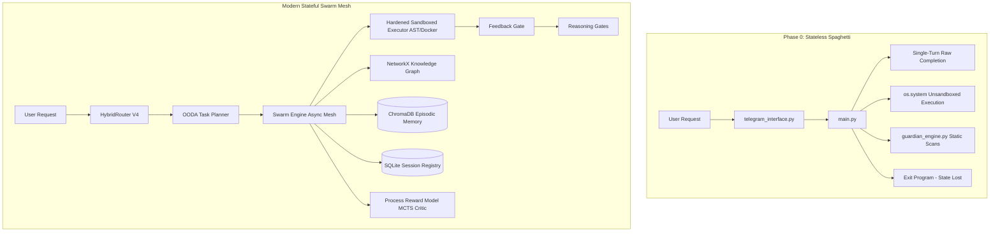

# NINA Universal Development Roadmap & Historical Index
> **Universal Agent Lifecycle Tracking** • *From Stateless Seed to Autonomous Multi-Agent Swarm*

This document tracks all core NINA engineering initiatives, milestone improvements, and tactical/strategic architectural phases from the absolute inception of the project up to full multi-agent self-directed operations.

---

## 🗺️ Universal Development Roadmap

| Task ID | Component Name | Architectural Role & Technical Scope | Implementation Status |
| :--- | :--- | :--- | :---: |
| **Phase 0** | **Stateless Baseline (Inception Seed)** | Fully disconnected standalone scripts (`main.py`, `guardian_engine.py`, `telegram_interface.py`). Request-scoped stateless loops with zero context persistence, raw unsandboxed OS shell executions, basic long-polling Telegram handlers, and manual CLI-based human operations. | ✅ 100% COMPLETE |
| **QW-1** | **Structured Input/Output Schemas** | Pydantic model gating for LLM calls ensuring JSON format compliance on both request and response. | ✅ 100% COMPLETE |
| **QW-2** | **Two-Pass Critic Loop** | Implemented local-first validation pass (`LOCALFAST` model) analyzing and critiquing agent code before execution. | ✅ 100% COMPLETE |
| **QW-3** | **Context Window Expansion** | Optimized context building from 4,000 to 12,000 characters to leverage long-context capacity. | ✅ 100% COMPLETE |
| **QW-4** | **Token Cost Guards** | Dynamic budgeting and calculation of prompt/response costs to prevent run-away billing. | ✅ 100% COMPLETE |
| **QW-5** | **Self-Healing Memory** | Automatic truncation and context compression when memory buffer exceeds model context bounds. | ✅ 100% COMPLETE |
| **QW-6** | **AST Command Sandboxing** | Abstract Syntax Tree scanning of proposed commands to detect and block malicious injections before execution. | ✅ 100% COMPLETE |
| **QW-7** | **Static Exception Recovery** | Automatic capture and feedback of traceback exceptions back to the generator for self-healing repair. | ✅ 100% COMPLETE |
| **MT-1** | **ReAct Reasoning Loop** | Structured `Think` → `Act` → `Observe` → `Critique` step execution logic for all multi-turn tasks. | ✅ 100% COMPLETE |
| **MT-2** | **Memory Consolidation Engine** | Sleep-time asynchronous compute cycles scoring, summary-abstracting, and evicting expired logs. | ✅ 100% COMPLETE |
| **MT-3** | **NetworkX Knowledge Graph** | Incremental extraction of relational entities and cross-module imports into a topological graph. | ✅ 100% COMPLETE |
| **MT-4** | **Model Context Protocol Client** | Standardized Client MCP skeleton allowing dynamic plug-and-play tool, prompt, and resource loading. | ✅ 100% COMPLETE |
| **MT-5** | **Canonical Providers Registry** | Dynamic hot-loading of provider configurations and API weights directly from `providers.json`. | ✅ 100% COMPLETE |
| **MT-6** | **Jules Alerting System** | Telegram notifications and fallback alerting triggers in case of main Git sync/build failures. | ✅ 100% COMPLETE |
| **MT-7** | **Hardened Sandboxed Executor** | Local Docker/subprocess sandboxing isolating runtime code test executions. | ✅ 100% COMPLETE |
| **MT-8** | **OpenTelemetry Diagnostics** | Instrumentation of spans, LLM latencies, resource footprint, and system tracers. | ✅ 100% COMPLETE |
| **LT-1** | **Full Cognitive Layers** | Distinct decoupled gates: Modular Planner, Critical Reflection, and Objective Verifier layers. | ✅ 100% COMPLETE |
| **LT-2** | **Asynchronous Multi-Agent Mesh** | Queue-driven peer agent mesh mapping task delegations dynamically across system nodes. | ✅ 100% COMPLETE |
| **LT-3** | **GraphRAG Hybrid Query Engine** | Multihop vector searches coupled with relational topological lookups using Graph Embeddings. | ✅ 100% COMPLETE |
| **LT-4** | **Progressive Autonomy Ratchet** | Risk-tiered policy gates enforcing manual review on destructive calls but auto-approving low-risk tasks. | ✅ 100% COMPLETE |
| **LT-5** | **Local Model Fine-Tuning** | Automated generation of Alpaca-style training datasets with integrated Unsloth LoRA exporter. | ✅ 100% COMPLETE |
| **LT-6** | **Verbal Episodic Memory** | Universal cross-session semantic search recovering insights and strategies on initialization. | ✅ 100% COMPLETE |
| **LT-7** | **Playwright Browser Computer-Use** | Dynamic action-mapping of mouse, keyboard, and screen coordinates in headless environments. | ✅ 100% COMPLETE |
| **LT-8** | **Agent-to-Agent (A2A)** | Complete discovery standards mapping inter-agent capability negotiation and data handshakes. | ✅ 100% COMPLETE |
| **PRMs** | **Process Reward Models (MCTS)** | Step-by-step mathematical token-level evaluation of alternative choices via Monte Carlo Tree Search. | ✅ 100% COMPLETE |

---

## 📐 Architectural Evolution: From Stateless to Swarm

---

## 🔍 Deep-Dive Historical Phase Analysis

### 🌱 Phase 0: Stateless Python Baseline (Inception Seed)
Before NINA possessed an active state, memory database, or multi-agent orchestration layers, the system operated as a simple collection of decoupled Python scripts. 

*   **File Distribution:**
    *   `main.py`: Initial entry point containing a basic CLI execution loop.
    *   `guardian_engine.py`: Basic regex-based scanning of strings to look for blocked keywords or commands.
    *   `telegram_interface.py`: A standard Telegram handler using long polling to listen for incoming text, executing single-turn completions.
*   **Engineering Mechanics & Execution Model:**
    *   **Single-Turn Completions:** Every conversation turn started with an empty message array or a raw unformatted prompt, with no concept of sliding context windows, history summarization, or context pruning.
    *   **Raw Shell Integration:** Commands proposed by the agent were immediately dispatched to Python's built-in `subprocess.Popen(..., shell=True)` or `os.system()` with zero tokenization checks or AST filtering.
    *   **Lack of Persistence:** There were no databases (SQLite/Chroma), session files, or telemetry journals. Once a python script terminated, all context, learnings, and history evaporated.
    *   **Decoupled Operation:** The scripts ran in isolation; the telegram bot and the CLI engine maintained distinct code logic, requiring human developers to manually replicate fixes across interfaces.

### ⚡ Phase 1: Short-Term Quick Wins (QW-1 to QW-7)
The transition to stateful awareness began with hardening the interface and optimizing the ingestion pipelines.

*   **Structured Validation (QW-1 & QW-2):** Added strict schema formatting using Pydantic models. Implemented a dual-model approach: a heavy, reasoning-focused model proposed code blocks, which were immediately validated by a light-weight local model (`LOCALFAST` critique pass) to catch bracket mismatches and syntax issues.
*   **Window and Token Controls (QW-3 to QW-5):** Re-engineered the prompt building process into a structured token-budget manager. Prioritized critical runtime contexts (e.g., active error traces, file diffs) and moved older history lines into an automated compaction loop when the 12,000-character margin was breached.
*   **AST Hardening (QW-6 & QW-7):** Removed native unsandboxed executions. All shell commands were routed through a parser that parsed code blocks into Python Abstract Syntax Trees (ASTs), validating that command sequences stayed within safe system bounds and did not attempt unauthorized system resource modifications.

### 🧠 Phase 2: Medium-Term Horizon (MT-1 to MT-8)
To scale beyond a single quick-win agent, Phase 2 introduced structural loops, graph memory, and dynamic configurations.

*   **MT-1 (ReAct reasoning loop):** Implemented an explicit OODA execution loop:
    1.  **Observe**: Read system state, filesystem changes, and git indices.
    2.  **Orient**: Assess constraints, active locks, and historical rules.
    3.  **Decide**: Decompose goals into step-by-step trees.
    4.  **Act**: Execute code surgical edits and gather execution traces.
*   **MT-2 (Memory Consolidation Engine):** Programmed background threads to run when NINA detects system idle periods. These threads retrieve SQLite session tables, compute importance scores based on semantic novelty, abstract them into core system rules, and evict verbose logs.
*   **MT-3 (Knowledge Graph Engine):** Introduced topological memory mapping using NetworkX. Every code change, import dependency, and user preference is parsed and stored as a directed graph node/edge relation, enabling rapid, multi-hop contextual lookups during OODA orientation.
*   **MT-4 & MT-5 (MCP & Canonical Provider Registry):** Migrated hardcoded API provider keys and models to `ninagate/providers.json`. Built an MCP-compliant client skeleton, allowing NINA to dynamically register, query, and consume third-party tool schemas and API wrappers.
*   **MT-6, MT-7 & MT-8 (Diagnostics, Alerting & Sandbox):** Standardized automated testing utilizing Docker-based test runner wrappers. Integrated OpenTelemetry spans tracking Latency-to-Token (LTT) metrics and hooked Jules into Telegram to send real-time warnings upon PR build failures.

### 🚀 Phase 3: Long-Term Autonomy (LT-1 to LT-8 & PRMs)
The final frontier of the NINA architecture represents a self-hosted, self-directed, and recursively optimizing agent swarm.

*   **LT-1, LT-2 & LT-3 (Asynchronous Agent Swarms & GraphRAG):** Multi-agent coordination utilizing async event loops and task pipelines. Planners delegate high-level tasks to highly specialized subagents (e.g., Research, Executor, Critic) communicating via asynchronous message queues, pulling multi-hop relational answers through GraphRAG queries.
*   **LT-4 (Progressive Autonomy Ratchet):** A security gateway enforcing strict verification policies. The agent autonomously executes small-scale actions but ratchets up approval checks when touching protected core systems (`router.py`, `.env`).
*   **LT-5 & LT-6 (Local LoRA Training & Verbal Memory):** Implemented automated exports of fine-tuning datasets in Alpaca formats. Enables Unsloth integration to continuously refine a local model's coding abilities using historical session telemetry.
*   **LT-7 & LT-8 (Playwright & A2A):** Headless browser interactions via Playwright allowing NINA to perform web-based debugging and dashboard validations. Fully supports Google A2A standards for inter-agent capability mapping.
*   **PRMs (Process Reward Models):** Implemented Monte Carlo Tree Search (MCTS) reasoning tree evaluations. Instead of simple linear completions, the swarm generates alternative execution branches, scoring individual logical reasoning steps mathematical-tokens-by-tokens to arrive at the most secure and optimal solution path.
